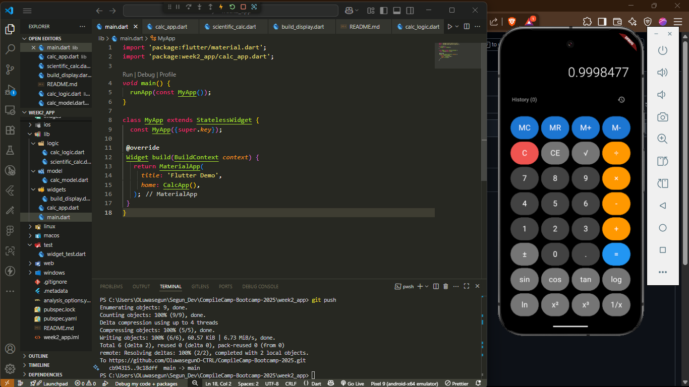

# week2_app

## Interactive Calculator App with scientific Function

This is a comprehensive app that demonstrates advanced dart concepts and stateful widget management.

This is the week 2 project for the compilecamp bootcamp.

