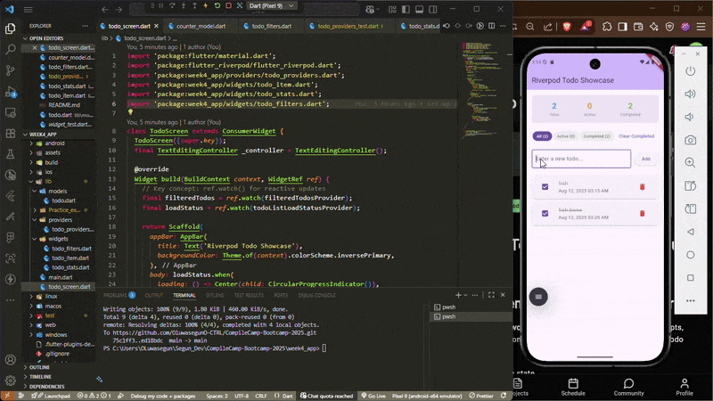
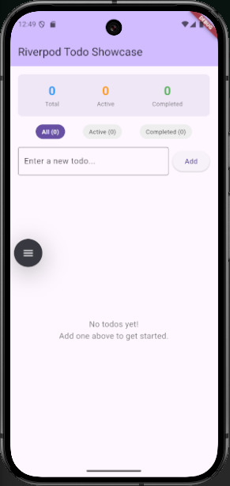
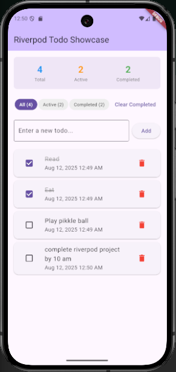

# Riverpod Todo App

This project is a simple yet effective Todo application built with Flutter that demonstrates the core concepts of state management using the `flutter_riverpod` package. It showcases how to structure a Flutter application with a clear separation of UI, state, and business logic.



## ✨ Features

  * **Add Todos**: Quickly add new tasks to your list.
  * **Toggle Completion**: Mark tasks as complete or active.
  * **Delete Todos**: Remove tasks you no longer need.
  * **Filter Todos**: View all, active, or completed tasks.
  * **Clear Completed**: Easily clear all completed tasks with a single button.
  * **Real-time Stats**: See a live-updating count of total, active, and completed todos.
   * **Data Persistence**: Todos are saved locally and persist between app launches.


## 🚀 Core Concepts Demonstrated

This project serves as a practical example of how to leverage different Riverpod providers to manage application state efficiently.

### State Management with Riverpod

The app is built around `flutter_riverpod` for a reactive and robust state management solution.

  * **`StateNotifierProvider`**: Used for managing the list of todos (`todoListProvider`). The `TodoListNotifier` class contains all the business logic for adding, deleting, toggling, and clearing todos, ensuring that the UI reacts to any changes in the todo list.

  * **`StateProvider`**: Employed for simpler state, like managing the current filter (`todoFilterProvider`). This allows the UI to easily read and update the active filter (All, Active, or Completed).

  * **`Provider`**: Leveraged for computed or derived state. The `filteredTodosProvider` dynamically computes the list of todos to display based on the current filter, and `todoStatsProvider` calculates statistics (total, active, and completed counts). This ensures that the UI is always in sync with the application's state without any manual state synchronization.

### Data Persistence with SharedPreferences

The app uses `shared_preferences` to persist todo data between app sessions:

  * **Automatic Saving**: Todos are automatically saved to local storage whenever the list changes (add, toggle, delete, or clear completed).
  * **Initial Loading**: Todos are loaded from storage when the app starts.
  * **JSON Serialization**: Todo objects are serialized to JSON for storage and deserialized when loaded.
  * **Error Handling**: Includes basic error handling for storage operations.


### UI and Widgets

The UI is composed of several distinct widgets, each with a specific responsibility:

  * **`TodoScreen`**: The main screen that assembles the different components of the app.
  * **`TodoItem`**: A widget that represents a single todo item and handles user interactions like toggling completion and deletion.
  * **`TodoFilters`**: A set of filter chips that allow the user to switch between different views of the todo list.
  * **`TodoStats`**: A display area that shows the current statistics of the todo list.

This component-based architecture makes the code more modular, easier to understand, and maintainable.



## 📂 Project Structure

The project is organized into the following main directories and files:

```
lib/
|
|-- models/
|   |-- todo.dart           # Data model for a single Todo item
|
|-- providers/
|   |-- todo_providers.dart   # All the Riverpod providers for state management
|
|-- widgets/
|   |-- todo_item.dart        # UI for a single todo item
|   |-- todo_filters.dart     # UI for the filter options
|   |-- todo_stats.dart       # UI for displaying todo statistics
|
|-- main.dart               # Main entry point of the application
|-- todo_screen.dart        # The main screen of the todo app
```

## 🏃‍♀️ How to Run

To run this project, ensure you have Flutter installed. Then, follow these steps:

1.  Clone the repository.
2.  Navigate to the project directory.
3.  Run `flutter pub get` to install the dependencies.
4.  Run `flutter run` to launch the application on an emulator or connected device.